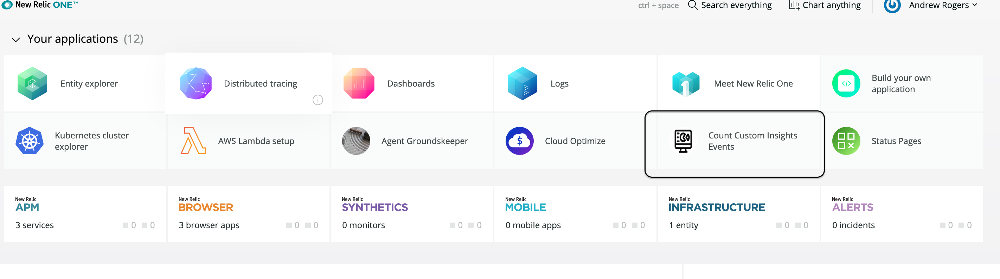
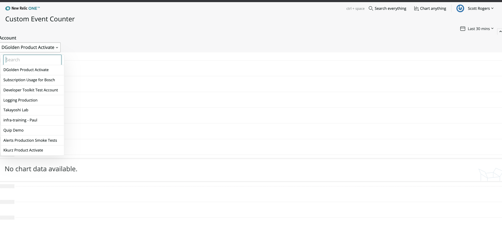
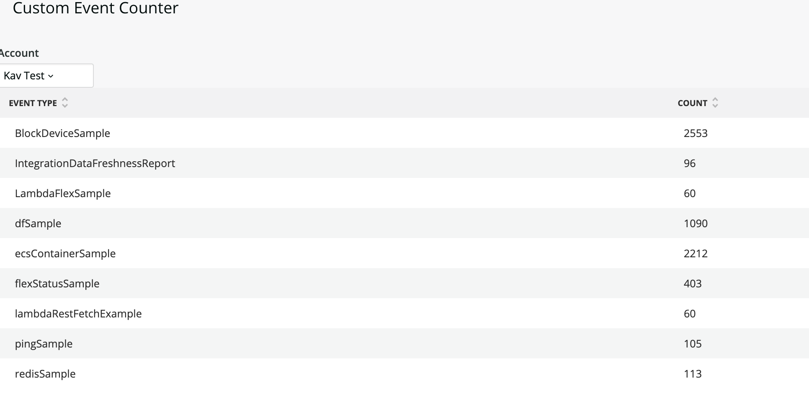

# Custom Event Counters

## Getting started


## What is this about?

I've recently received the request to provide counts of custom events from several customers. So I decided to build a nerdpack!

Clone it and run npm install:

```
npm install
```

Set the uuid to match the account you wish to use, such as:

> For example: `nr1 nerdpack:uuid -g  --profile newrelic-administration`


And then serve it locally like below: 

> `nr1 nerdpack:serve  --profile newrelic-administration`

you'll see all the accounts available to your account and that API key:


> Example: `nr1 create --type nerdlet --name my-nerdlet`.

The launcher looks like this: 



And the nerdpack should look something like this:



And when you choose an account with custom events you'll see something like this: 




## How does it work?

Pretty simple: Initial NRQL query `show event types` returns all the event types in the account. This is compared to a list of known types in `utils.js` ... 

Any event that is not found is considered "custom" and a NerdGraph query is constructed to retreive all counts at one time (see [this](https://stackoverflow.com/c/new-relic/questions/309) stackoverflow post). 

That is assembled into an object accepted by `<TableChart>` and rendered. 

The account picker is from the **nr1-status-page** nerdpack.

### What's next?

There are plenty of ways to improve, from error handling, to retreiving the known event types from a service. 


